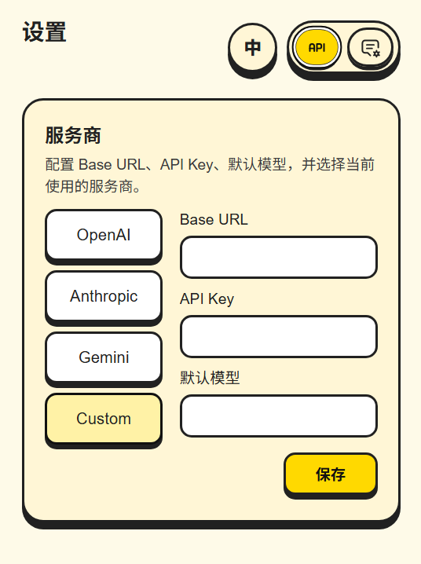
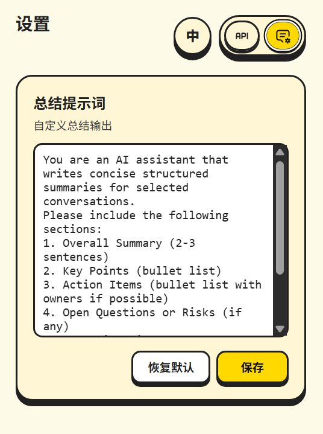
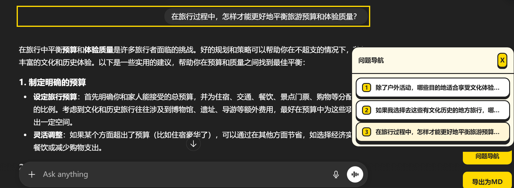
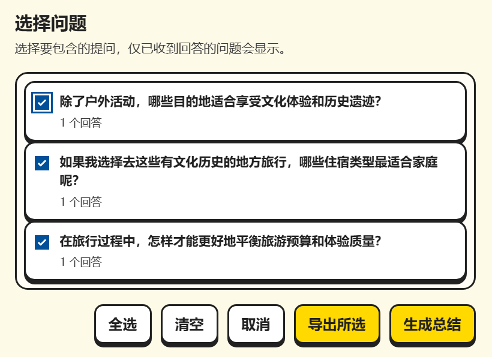

# GPT Exporter

**简体中文** | [英文](./README.EN.md)

一个用于将 ChatGPT 对话导出为 Markdown 并生成 AI 摘要的浏览器扩展。支持 Chrome、Edge 和 Firefox，支持中英双语。

## 项目描述

GPT Exporter 为 ChatGPT 添加导出和导航功能。它直接从页面解析对话内容，将消息分组为问答对，并导出为整洁的 Markdown 文档。扩展还支持使用外部 LLM 服务商生成对话摘要。

支持浏览器：
- Google Chrome
- Microsoft Edge
- Mozilla Firefox

## 功能截图

|                  设置服务商                  |                   总结提示词                   |                    问题导航                    |                     问题高亮页                     |                    导出为MD                    |
| :------------------------------------: | :----------------------------------------: | :--------------------------------------------: | :--------------------------------------------: | :------------------------------------------: |
|  |  |  |  |  |

## 安装方式

### Chrome / Edge

1. 前往 [Releases](../../releases) 页面
2. 下载 Chrome/Edge 版本的 `.zip` 文件
3. 解压下载的文件
4. 打开 `chrome://extensions`（Chrome）或 `edge://extensions`（Edge）
5. 在右上角启用"开发者模式"
6. 点击"加载已解压的扩展程序"，选择解压后的文件夹

### Firefox

1. 前往 [Releases](../../releases) 页面
2. 下载 Firefox 版本的 `.xpi` 文件
3. 打开 Firefox，进入 `about:addons`
4. 点击齿轮图标，选择"从文件安装附加组件..."
5. 选择下载的 `.xpi` 文件

## 使用方法

### 导出对话

1. 打开任意 ChatGPT 对话
2. 点击右下角的 **"导出 MD"** 按钮
3. 在选择弹窗中：
   - 勾选/取消勾选要包含的问答对
   - 使用"全选"或"清除"进行批量操作
4. 点击 **"导出所选"**
5. 输入文件名/或使用默认名称
6. 生成 Markdown 文件并下载

### 问题导航

1. 点击 **"问题导航"** 按钮
2. 打开面板，显示对话中所有问题
3. 点击任意问题跳转到对应位置并高亮问题
4. 点击 **X** 按钮关闭

### 生成摘要

1. 在扩展弹窗中配置 LLM 服务商：
   - 点击浏览器工具栏中的扩展图标
   - 选择服务商（OpenAI、Anthropic、Gemini 或自定义）
   - 输入 API 密钥和首选模型
   - 点击 **"保存"**
2. 打开 ChatGPT 对话
3. 点击 **"导出 MD"** 并选择问答对
4. 点击 **"生成总结"**
5. 输入摘要文件名
6. 摘要生成后下载为 Markdown 文件

### 自定义摘要提示词

1. 打开扩展弹窗
2. 点击标题栏中的提示词图标
3. 编辑提示词文本
4. 点击 **"保存"** 应用更改

## 开源许可

MIT License